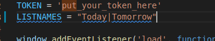

# Add Hour to Your Card Trello by Chrome Extension

This repository creates a offline chrome extension to put hour into trello card.

## Installation

##### 1. Create API Key

The first step is to create a API Key to get access to your trello cards from API. 
Using the link [Trello API](https://trello.com/app-key) you can create the API Key.

##### 2. Create and get token

 In the same page, you need create a token that also will be used in the requests to API Trello.

##### 3. Replace Key and Token in the script file

After get the two keys, replaces into the first two lines in the scripts.js file from repository.

##### 4. Select the Lists to put card hour

Below the key and token, you should select the lists that you want put the hour on cards. You can put more than one list put the names between '|'. For example, "Today|Tomorrow" will put the hour in all cards inside these lists.

##### 5. Put the extension to work on Chrome

###### 5.1. Open Google Chrome Extension

Open the google chrome extension option and click on "Load unpacked" option.

###### 5.2. Select the extension directory

Search and select the repository root directory.

###### 5.3. See the extension working

The module will be load and is ready to get used.

##### 6. Open your trello board

Now you can enter in your Trello boards and see the date and hour from deadlines cards. 

## License

The source code for the site is licensed under the MIT license, which you can find in
the MIT-LICENSE.txt file.

All graphical assets are licensed under the
[Creative Commons Attribution 3.0 Unported License](https://creativecommons.org/licenses/by/3.0/).
