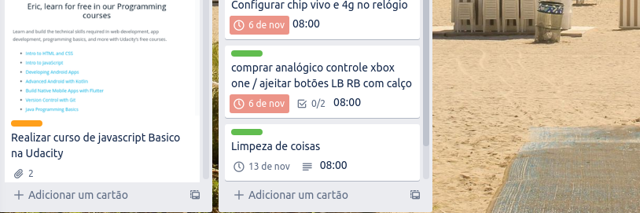
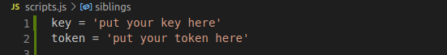
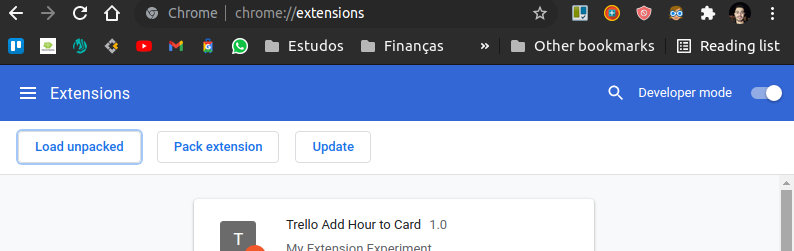
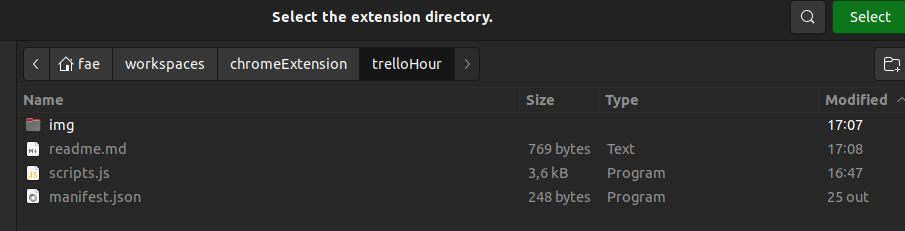
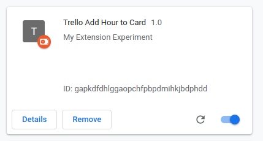

# Add Hour to Your Card Trello by Chrome Extension
This repository creates a offline chrome extension to put hour into trello card.

# Steps
1. The first step is to create a API Key to get access to your trello cards from API. 
Using the link below you can create the API Key.
https://trello.com/app-key

2. In the same page, you need create a token that also will be used in the requests to API Trello.

3. After get the two keys, replaces into the first two lines in the scripts.js file from repository.

4. Load the extension offline into your chrome.

4.1 Open the google chrome extension option and click on "Load unpacked" option.

4.2 Search and select the repository root directory.

4.3 The module will be load and is ready to get used.

5. Now you can enter in your Trello boards and see the date and hour from deadlines cards. 

## License

The source code for the site is licensed under the MIT license, which you can find in
the MIT-LICENSE.txt file.

All graphical assets are licensed under the
[Creative Commons Attribution 3.0 Unported License](https://creativecommons.org/licenses/by/3.0/).
